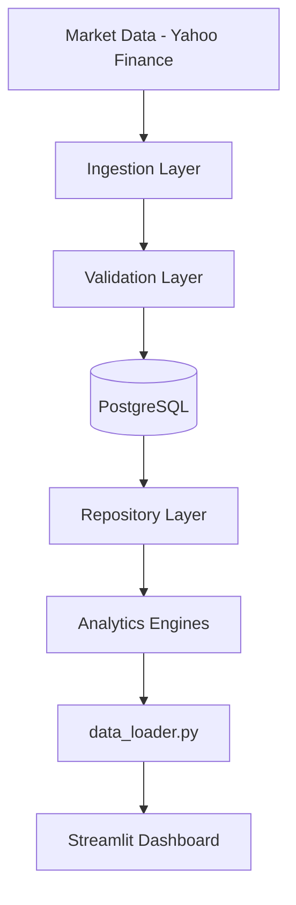

<div align="center">

# SENTINEL

**Quantitative Market Risk Analytics Platform**

Built with Python, PostgreSQL, and SQLAlchemy

[](https://www.python.org/)
[](https://streamlit.io/)
[](https://www.postgresql.org/)
[](https://www.sqlalchemy.org/)
[](./LICENSE)

[Live Demo](https://market-risk-sentinel.streamlit.app/) · [Getting Started](#getting-started) · [Architecture](#architecture)

</div>

---

## Overview

Investors and fund managers need to answer one question every day: **how much money could I realistically lose if the market turns bad tomorrow?**

**SENTINEL** takes historical price data across equities, crypto, commodities, and macro indicators, and calculates the worst-case loss to expect on a bad day — and how bad the *really* bad days could get. It then backtests its own predictions against what actually happened, so the output can be trusted rather than taken on faith.

## Table of Contents

- [Features](#features)
- [Tech Stack](#tech-stack)
- [Architecture](#architecture)
- [Risk Models](#risk-models)
- [Project Structure](#project-structure)
- [Getting Started](#getting-started)
- [Roadmap](#roadmap)
- [License](#license)

## Features

- 📊 **Multi-asset coverage** — SPY, QQQ, BTC, GLD, USO, VIX, TNX, DXY across equities, crypto, commodities, and macro indicators
- 📉 **Value at Risk (VaR)** — Historical and Parametric methods at 95%/99% confidence
- 🔻 **Expected Shortfall (CVaR)** — average loss beyond the VaR threshold
- ✅ **Model backtesting** — Kupiec, Christoffersen, and Basel Traffic Light frameworks
- 🌐 **Regime detection** — classifies market conditions (calm / volatile / trending)
- 🔗 **Correlation analytics** — cross-asset correlation matrix + rolling pairwise correlation
- 🗄️ **Raw data explorer** — search, filter, and export directly from PostgreSQL

## Tech Stack

| Layer | Technology |
|---|---|
| Frontend | Streamlit, Plotly |
| Backend / Data | PostgreSQL, SQLAlchemy |
| Analytics | Pandas, NumPy, SciPy |
| Ingestion | Yahoo Finance API |
| Testing | Pytest |

## Architecture



Every dashboard page reads through a single `data_loader.py` bridge — no page queries the database or runs a calculation directly, keeping analytics logic reusable and independently testable.

## Risk Models

<details>
<summary><strong>Value at Risk (VaR)</strong></summary>

<br>

- **Historical VaR** — uses the empirical distribution of past returns
- **Parametric VaR** — assumes a normal distribution using rolling mean/std
- Computed at **95%** and **99%** confidence, over a rolling **252-day** window

</details>

<details>
<summary><strong>Expected Shortfall (CVaR)</strong></summary>

<br>

Average loss *given that* the VaR threshold was breached — answers "if things go bad, how bad on average," which VaR alone doesn't capture.

</details>

<details>
<summary><strong>Model Validation / Backtesting</strong></summary>

<br>

- **Kupiec test** — checks observed VaR breach frequency against the expected rate
- **Christoffersen test** — checks whether breaches cluster in time (clustering implies understated risk during stress)
- **Basel Traffic Light** — regulatory Green/Yellow/Red classification of model reliability at 99% confidence over a 250-day window

</details>

<details>
<summary><strong>Regime Detection & Correlation</strong></summary>

<br>

- Classifies market regimes to contextualize risk metrics
- Cross-asset correlation matrix and rolling pairwise correlation over time

</details>

## Project Structure

```
SENTINEL/
├── app.py                 # Streamlit entry point
├── config.py               # App-wide constants
├── data_loader.py           # Single bridge between UI and backend
├── pages/                    # One file per dashboard page
├── components/                # Reusable UI components
├── services/                   # Derived/computed values
├── src/
│   ├── ingestion/                # Market data downloader
│   ├── validation/                 # Data quality checks
│   ├── repository/                   # Parameterized SQL access layer
│   ├── analytics/                      # VaR, ES, backtests, regime, correlation
│   ├── pipelines/                        # Ingestion → features → analytics orchestration
│   └── tests/                              # Pytest suite
└── database/                    # SQL schema definitions
```

## Getting Started

### Prerequisites
- Python 3.12+
- PostgreSQL 14+

### Installation

```bash
git clone https://github.com/indrxjith/SENTINEL.git
cd SENTINEL
pip install -r requirements.txt
cp .env.example .env   # then edit .env with your PostgreSQL credentials
```

### Run

```bash
python -m src.pipelines.master_pipeline   # ingest data + compute risk metrics
streamlit run app.py
```

## Roadmap

- [ ] CI pipeline (GitHub Actions) running the existing `pytest` suite on every push
- [ ] Replace broad exception handling in DB connectivity checks with structured logging
- [ ] Pin dependency versions in `requirements.txt`
- [ ] Add a caching layer for repeated dashboard queries over unchanged date ranges

## License

Distributed under the MIT License. See [`LICENSE`](./LICENSE) for details.

---

<div align="center">

Built by [indrxjith](https://github.com/indrxjith)

</div>
